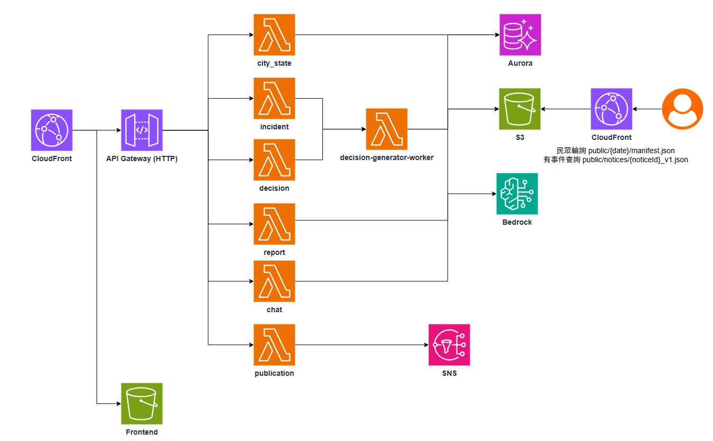

# AI City Commander

AI City Commander 是一套面向大型城市活動與交通事件的智慧營運指揮平台。系統以台北市交通與人流為場景，整合即時道路壅塞、捷運站點人流、突發事故、SOP 規則引擎與 AI 決策代理，協助指揮中心在事件發生後快速產生分流建議、跨單位協調資訊、公開告警內容與事後報告。

本專案包含 React 前端指揮台、Python Serverless 後端、AWS 基礎設施定義、SOP/LLM 決策模組，以及公開告警佈署。

## 特色亮點

- **政府端／民眾端雙模式介面**：同一份地圖與事件資料，依身份切換呈現內容。政府端可見完整 SOP 推理鏈、內部決策依據與跨機關協調建議；民眾端僅呈現摘要化的公開訊息與重點城市狀態，兩種身份各自維護獨立的對話紀錄，避免內部決策細節誤發給一般民眾。
- **「現場定位小人」地圖互動**：可將地圖右上角的人形圖示拖曳並放置到地圖上的任意位置，系統會即時回報該座標的鄰近路段與及時相關狀態，並自動附掛為 AI 聊天室的「目前位置」情境標籤。放置後向小助手提問（例如「我這裡現在狀況如何」），回覆就會直接關聯到最近路段的即時路況與相關 SOP 決策建議，而不需要手動輸入地點。
- **可擴展的公開告警發布路徑**：民眾端大量讀取告警內容改由 CloudFront 直接讀取 S3 manifest/notice，不經過 API Gateway 與 Lambda。`experiments/incident-manifest-polling/` 的壓測結果顯示，在 1,000 與 10,000 client 規模下，此路徑的延遲與穩定度都明顯優於走 Lambda proxy 的方案。
- **事故到報告的完整流程**：從事故建立、SOP 規則觸發、AI 決策生成，到多語公開訊息與事後報告匯出，全程資料保留可追溯的欄位。

## 專案目標

- 即時呈現道路、場站與事故狀態，支援政府端與民眾端兩種視角。
- 根據 SOP 規則判斷交通壅塞、事故封閉、捷運分流、場館疏散、號誌故障與多語告警需求。
- 結合 LLM 產生可解釋的決策理由、行動建議、公開訊息與情境問答。
- 將內部決策與公開資訊分流保存，降低敏感資訊外洩風險。
- 以 AWS Serverless 架構支援 API、事件處理、報告產生、公開告警與網站部署。

## 核心功能

### 1. 城市營運儀表板

前端以 React、Vite、Mapbox、deck.gl 與 Zustand 建置。主要畫面包含：

- 地圖舞台：顯示道路壅塞、替代路線、事故位置與場站熱點。
- 時間軸：播放城市事件狀態變化。
- 左側決策面板：事件摘要、SOP 推理鏈、決策建議、公開訊息預覽與匯出功能。
- 右側資訊面板：道路與站點清單、狀態指標與圖例。
- 底部事件列：事故與告警時間序列。
- AI 聊天助理：支援政府端 what-if 問答與民眾端公開資訊問答。

### 2. SOP 規則與 AI 決策

系統目前涵蓋下列 SOP 類型：

- SOP 1：交通擁塞級別判定。
- SOP 2：車禍與路障應變。
- SOP 3：捷運與接駁分流。
- SOP 4：大巨蛋散場啟動。
- SOP 5：號誌故障應變。
- SOP 6：數位通報與多語化。
- SOP 7：預計恢復時間 (ETE) 計算。

### 3. API 與事件流程

後端 API 路由定義於 Terraform 與本機 server，主要包含：

| Method | Path                              | 用途                                            |
| ------ | --------------------------------- | ----------------------------------------------- |
| `GET`  | `/api/city-state`                 | 查詢指定 `scenarioAt` 的交通與人流狀態          |
| `POST` | `/api/incidents`                  | 建立或注入事故事件                              |
| `GET`  | `/api/incidents/{eventId}/report` | 查詢事故報告產生狀態，JSON 格式完整內容內嵌回傳 |
| `GET`  | `/api/decisions`                  | 查詢指定時間與位置的決策結果                    |
| `POST` | `/api/chat/messages`              | 送出政府端或民眾端問答                          |
| `POST` | `/api/publication`                | 發布告警訊息                                    |
| `GET`  | `/api/experiments/public-notices` | 實驗用公開 notice/manifest 查詢                 |

### 4. 公開告警與報告

系統將內部決策快取、事故報告與公開告警分開保存：

- Internal S3 bucket：事故資料、決策快取、政府端報告（JSON/PDF，由 `backend/service/report_builder.py` 產生並歸檔）。
- Public S3 bucket + CloudFront：公開 notice 與 manifest。
- Report API：JSON 報告以完整內容內嵌回傳；前端「匯出」按鈕則直接以現有事件/決策資料在瀏覽器端即時產生 PDF／JSON，確保匯出功能不受後端報告產生時間影響。
- Publication API：產生多語訊息、發布狀態與 channel status。

## 系統架構

### AWS 雲端運行架構



系統只使用單一 CloudFront distribution，依路徑分流到三個不同 origin：

- 預設路徑（`/*`）→ frontend S3 bucket：提供 React SPA 靜態資源。
- `/api/*` → API Gateway (HTTP API) → 對應的 Lambda（`city_state`、`incident`、`decision`、`report`、`chat`、`publication`）。
- `/public/*` → public results S3 bucket：民眾端輪詢公開 manifest/notice 直接由 CloudFront + S3 回應，不經過 Lambda，對應上方「特色亮點」中的大量輪詢壓測結論。

`incident` 與 `decision` 在快取未命中時，會非同步觸發 `decision-generator-worker`，整合 Aurora Serverless（城市/事故資料）與 Amazon Bedrock（LLM 推理與敘事生成），將結果寫回 Aurora 與 internal / public results 兩個 S3 bucket，落實政府端與民眾端資料分流保存。`publication` Lambda 另外掛載一個 SNS topic，作為未來串接簡訊、推播等多通路示警的擴充點；目前競賽版本以模擬 `published` 狀態回傳各發布通路結果。

### 專案目錄結構

```text
.
├── frontend/                       # React + Vite 前端指揮台
│   ├── public/data/                # CSV/JSON 資料
│   ├── src/components/             # 地圖、面板、圖表、聊天與共用 UI
│   ├── src/engine/                 # SOP 規則
│   ├── src/services/               # API adapter、聊天、LLM adapter、公開 notice
│   └── src/store/appStore.ts       # 全域狀態、時間軸與事件流程
├── backend/
│   ├── service/                    # Python Lambda handlers 與本機 server
│   │   ├── agent/                  # LLM client、facts、decision agent、narrator
│   │   ├── rules/                  # SOP 規則與 fallback 邏輯
│   │   ├── tests/                  # 後端單元測試
│   │   └── local_server.py         # 本機 API server
│   └── terraform/                  # AWS infra: API Gateway、Lambda、Aurora、S3、CloudFront
└── experiments/                    # 公開告警輪詢壓測與比較報告
```

## 環境需求

### 前端

- Node.js 20 以上
- npm
- Mapbox access token

### 後端本機開發

- Python 3.12
- pip
- AWS CLI（需要連接 AWS 或測試 Bedrock/S3 時）

### AWS 部署

- Terraform 1.10 以上
- Docker Desktop
- AWS CLI 與可部署目標帳號的憑證
- 可用的 AWS region
- Amazon Bedrock model access 或其他支援的 provider 設定

## 快速開始

### 1. 安裝前端依賴

```bash
cd frontend
npm install
```

### 2. 設定前端環境變數

PowerShell：

```powershell
Copy-Item .env.example .env.local
```

macOS / Linux：

```bash
cp .env.example .env.local
```

請至少設定：

```env
VITE_MAPBOX_TOKEN=your_mapbox_token_here
VITE_DATA_SOURCE=api
VITE_API_BASE_URL=https://your-api.example.com/api
```

### 3. 啟動前端

```bash
npm run dev
```

Vite 預設會啟動於：

```text
http://localhost:5173/
```

## 本機後端開發

### 1. 安裝 Python 依賴

```bash
cd backend/service
pip install -r requirements-dev.txt
```

### 2. 啟動本機 API server

```bash
python local_server.py 8787
```

接著在 `frontend/.env.local` 設定：

```env
VITE_DATA_SOURCE=api
VITE_API_BASE_URL=http://localhost:8787/api
```

### 3. 可選：設定 LLM provider

後端會依序使用下列環境變數選擇 LLM provider：

```env
BEDROCK_AGENTCORE_RUNTIME_ARN=
BEDROCK_MODEL_ID=
AWS_REGION=
ANTHROPIC_API_KEY=
OMNIROUTE_BASE_URL=
OMNIROUTE_MODEL=
```
