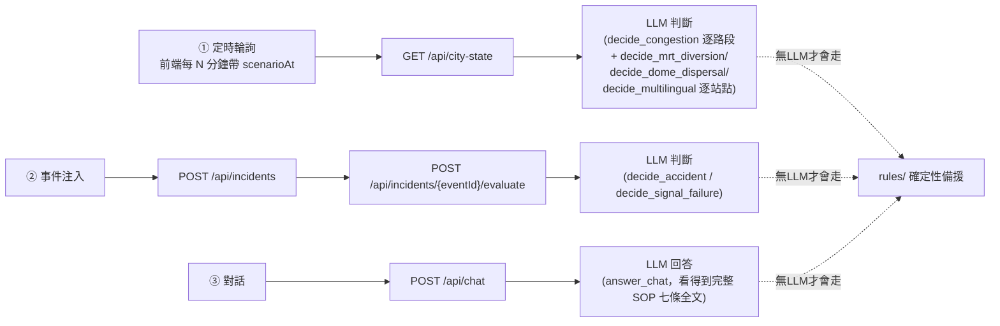
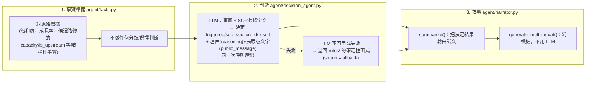
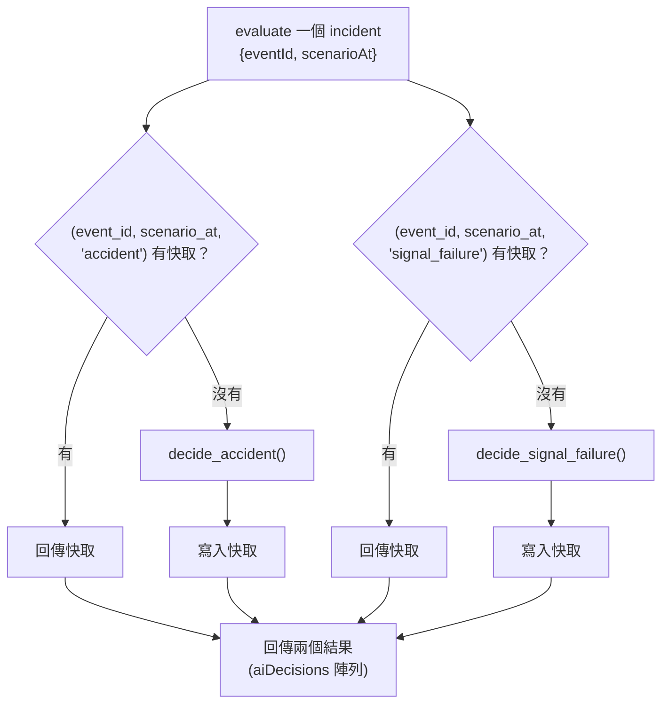
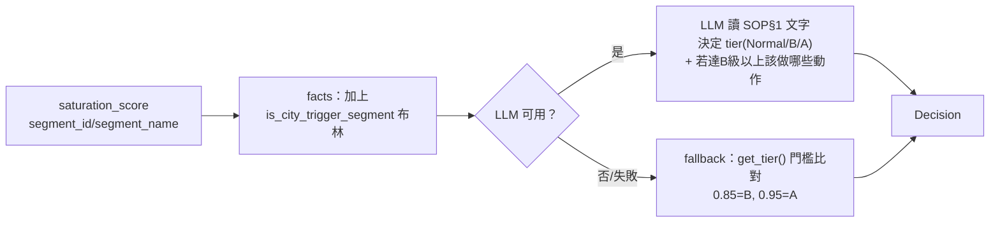
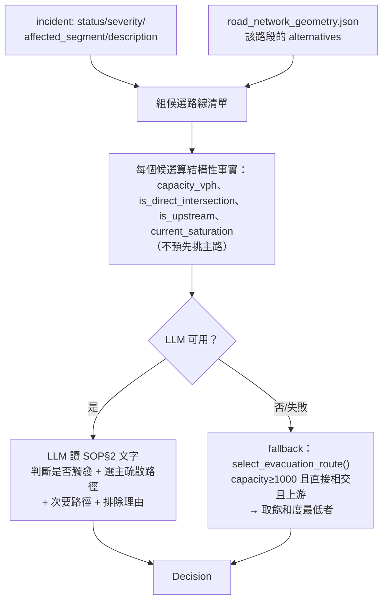
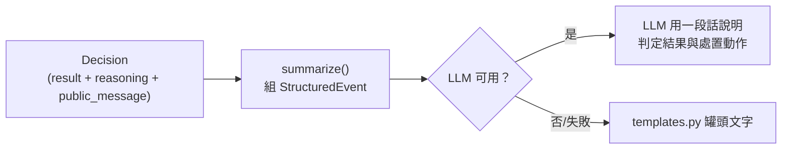

# AI 判斷 Pipeline 總覽

本文件整理目前後端（`backend/service/`）所有情境的完整資料流，從觸發、事實準備、
LLM 判斷、到敘事輸出。程式碼結構與判斷/計算/敘事三層架構的設計理由見
`backend/README.md`；本文件著重「一個請求怎麼從頭走到尾」。

## 模擬時鐘：`scenarioAt`

前端目前（尚未串接後端前）自己維護一個會流動的模擬時鐘：`App.tsx` 用
`setInterval(() => advanceTime(), playbackSpeed)` 驅動 `appStore.ts::advanceTime()`，
每個 tick 推進 `currentTime`，並且用 `timestamp < currentTime` 過濾車流/人流資料、
偵測事件時間到了自動注入、跑所有 SOP 判斷——這整條線目前 100% 在前端 TypeScript
裡，還沒有呼叫任何後端 API。後端這邊已經照著這個「模擬時間」概念設計好對應介面：
每次請求都帶一個 `scenarioAt`（ISO8601 帶時區），後端用它去查 DB 裡
「observed_at/occurred_at <= scenarioAt」的資料，不會洩漏未來還沒發生的資料——
之後前端只要把 `advanceTime()` 算出的模擬時間當參數丟過來，就能直接換成呼叫這些
API，不用把判斷邏輯留在前端。

## 三條產品層級觸發路徑（2026-07-31 定案）

系統只有三種情況會讓 SOP 判斷真的發生，**三種都必須真的走 LLM**，不可以在
任何一條上用寫死的門檻比較取代：



1. **定時輪詢**：`GET /api/city-state?scenarioAt=...`。命題 Module 1 寫的是
   「系統需依時間軸自動讀取並展示**車流與人流數據**」「當數據達到 SOP 預警
   門檻時...自動跳出分析摘要」——沒有限定只算車流，所以這支對車流跟人流都要判斷：
   - 每個路段呼叫 `decide_congestion()`（SOP§1，Normal/B/A + 處置動作），
     按 `(segment_id, scenario_at)` 快取。
   - `BS_MRT_BL17` 呼叫 `decide_mrt_diversion()`（SOP§3），
     `BS_TPE_DOME` 呼叫 `decide_dome_dispersal()`（SOP§4），
     兩者按 `(station_id, scenario_at, decision_kind)` 快取於 `crowd_decisions`。
   - 所有目前看得到的站點一次呼叫 `decide_multilingual()`（SOP§6，批次判斷，
     不是逐站各打一次 LLM），快取在同一張表、用 `_ALL_STATIONS_` 當 station_id。
   全部同一個模擬時刻重複輪詢都不會重複呼叫 LLM。
2. **事件注入**：`POST /api/incidents` 建事件，再 `POST /api/incidents/{eventId}/evaluate`
   觸發判斷。**2026-07-31 修正**：不再依 `incident.type` 猜只問一個
   `decide_*()`——每個事件都**同時、獨立**檢查 `decide_accident()`（SOP§2）跟
   `decide_signal_failure()`（SOP§5），各自都可能是 true 或 false，一個事件可以
   同時觸發兩條，也可能兩條都不觸發，不會因為預先猜測型別而漏掉邊際情況。按
   `(event_id, scenario_at, alert_kind)` 分別快取，`alert_kind` 讓同一事件的
   兩種檢查互不覆蓋。`GET /api/city-state` 現在也會對「當下每一個 active
   incident」自動跑這兩個檢查（不用另外手動呼叫 evaluate），一次輪詢裡有多少
   事件就分別判斷多少次。
3. **對話**：`POST /api/chat`（政府/民眾共用）呼叫 `answer_chat()`——LLM
   看得到完整 SOP 七條全文（不是關鍵字比對出來的片段），直接針對使用者的自由
   文字問題（含 What-if 假設情境）作答並引用條號。

三條路徑都遵守同一個容錯規則：**沒有設定 LLM 憑證、或呼叫失敗，才會退回
`rules/` 的確定性函式**——這是安全網，不是平常會走的路徑。只要 LLM 有設定
且能連上，判斷結果一律以 LLM 為準。

`POST /api/agent`（`action=decide`/`summarize`/`answer_what_if`）是給單一情境
獨立測試/除錯用的低階介面，不對應任何一條產品路徑，前端正常運作不會呼叫它。

## 三層架構（每個情境共用）



**判斷跟敘事是兩次獨立呼叫**（對應 `decide` 與 `summarize` 兩個 action），這是刻意的：
`decide` 的輸出（`result` + `reasoning`）本身已經有 LLM 產出的判斷依據，`summarize` 是選配的
第二層——如果前端想把 `decide` 的 `result`/`reasoning` 包裝成更長的「建議書」全文，
可以把它塞進 `summarize` 的 `data` 欄位讓 narrator 再潤一次；如果 `decide` 的
`reasoning` 已經夠用，也可以跳過 `summarize` 直接呈現。

**`reasoning` 跟 `public_message` 是兩種受眾，不是兩次呼叫**（這點跟上面「判斷/敘事分兩次」
不衝突）：兩者都是 `decide()` 同一次 LLM 呼叫的輸出。`reasoning` 給政府/指揮官看，
引用 SOP 條號、門檻數字、內部處置細節；`public_message` 給一般民眾看，只講行動建議，
不能出現 SOP 條號、門檻數字、規則名稱或警力/號誌等內部調度細節（見 `data/api.md`
第638行的 chat 端點政府/民眾模式區隔，以及 public/internal 兩個 S3 bucket 的權限設計）。
未觸發（`triggered=false`）時 `public_message` 為空字串。前端絕對不能把 `reasoning`
拿去顯示給民眾模式看，也不能用截斷/精簡 `reasoning` 的方式湊出民眾版文字——那等於
繞過這個區隔，一樣會洩漏內部推理內容。

## 快取：同一個事件、同一個模擬時間、同一種 SOP 檢查，不重複呼叫 LLM

`response_alerts` 的唯一索引是 `(event_id, scenario_at, alert_kind)`——多帶
`alert_kind` 是因為一個事件現在會被**同時、獨立**檢查兩種 SOP（見下），兩種
檢查各自快取，不會互相覆蓋：



這對 demo 很重要：如果評審把時間軸拉回同一個模擬時刻，看到的判斷結果會是同一份
（不會因為 LLM 每次生成不一樣而讓同一個時間點出現不同答案），也省掉重複呼叫的
延遲跟費用。

**2026-07-31 修正**：原本是用 `incident.type` 猜只問一個 `decide_*()`
（`Power_Failure` → 只問號誌故障；其餘 → 只問事故疏散），這其實是一種「純邏輯
篩選」，會漏掉「一個事件同時符合兩條 SOP」的邊際情況。現在改成兩個檢查都一定
會跑，各自的 `triggered` 由 LLM／備援獨立判斷，不再用型別預先排除任何一條。

---

## 情境 1：交通擁塞分級（SOP 第1條）

| | |
|---|---|
| 資料來源 | `city_traffic_flow.csv` → 逐路段 `saturation_score` |
| 觸發路段 | 僅 RD_TPE_001（忠孝東路）、RD_TPE_002（光復南路） |
| facts 函式 | `agent/facts.py::decide_congestion()` |
| fallback | `rules/congestion_tier.py::get_tier()` + `check_city_response()` |



**request**（`POST /api/agent`）：
```json
{"action":"decide","scope":"congestion",
 "segmentId":"RD_TPE_001","segmentName":"忠孝東路四段","saturationScore":0.96}
```
**facts 丟給 LLM 的內容**：`{"segment_id","segment_name","saturation_score","is_city_trigger_segment"}` ——不含 `tier`。

**response**：`{"triggered","sopSectionId","result":{"tier","actions"},"reasoning","publicMessage","source"}`
（`publicMessage` 是給民眾看的一句話，例如「附近路段車流壅塞，建議改道通行」——不含 tier 字母、SOP 條號）

---

## 情境 2：事故／路障疏散（SOP 第2條）—— 最複雜的一支

| | |
|---|---|
| 資料來源 | `live_incidents.json`（事件）+ `road_network_geometry.json`（路網拓撲）+ 即時飽和度 |
| facts 函式 | `agent/facts.py::decide_accident()` |
| fallback | `rules/accident_response.py::is_accident_trigger()` + `select_evacuation_route()` |



**request**：
```json
{"action":"decide","scope":"accident",
 "incident":{"eventId":"...","type":"Road_Collapse_Accident","location":"光復南路與忠孝東路口南側",
             "affectedSegment":"RD_TPE_002","status":"Closed","severity":"Critical",
             "description":"...","timestamp":"2026-05-20 22:10"},
 "segments":[/* road_network_geometry.json 原始陣列，未轉換 */],
 "saturation":{"RD_TPE_002":1.0,"RD_TPE_004":0.78,"...":"..."}}
```
**facts 丟給 LLM 的內容**（節錄）：
```json
{"incident":{...},
 "candidate_alternative_routes":[
   {"segment_id":"RD_TPE_004","name":"市民大道四段","capacity_vph":2500,
    "is_direct_intersection":true,"is_upstream":true,"current_saturation":0.78},
   {"segment_id":"RD_TPE_008","name":"延吉街","capacity_vph":600,
    "is_direct_intersection":true,"is_upstream":true,"current_saturation":0.8}
 ]}
```
注意：candidates 裡沒有 `main_route`/`selected` 這種欄位——挑哪條當主路是 LLM 的決定，
不是程式碼算好塞進去的。

**response 的 `result`**：`{"main_route","secondary_routes","excluded":[{"segment_id","reason"}],"congestion_warning","recommend_public_transit"}`
+ 同一次呼叫另外還有 `reasoning`（給指揮官，含候選路線篩選細節）與 `publicMessage`
（給民眾，例如「光復南路南下因路面塌陷全線封閉，請改道市民大道」——不含 segment_id、
candidate 篩選理由等內部細節）。

**正氣橋型未對應路口**：`road_network_geometry.json` 裡引用但不在 15 個追蹤路段內的路名
（如正氣橋），在 `rules/network_loader.py` 建圖時保留位置、標記 `None`，不會被靜默濾掉
導致後面索引位移——這個修正在 fallback 路徑跟 facts 組裝都適用（見 `data/unmatched_intersection_names.json`）。

---

## 情境 3：捷運與接駁分流（SOP 第3條）

| | |
|---|---|
| 資料來源 | `signaling_crowd_density.csv`，站點 BS_MRT_BL17 |
| facts 函式 | `decide_mrt_diversion()` |
| fallback | `rules/mrt_diversion.py::check_mrt_diversion()`（growth_rate > 0.30 或 user_count > 25,000） |

**request**：`{"action":"decide","scope":"mrt_diversion","snapshot":{"timestamp","stationId","locationName","userCount","stayTimeAvg","growthRate","roamingPct"}}`

facts 只給 `station_id`、`location_name`、`user_count`、`growth_rate`——門檻比對交給 LLM。

---

## 情境 4：大巨蛋散場啟動（SOP 第4條）

| | |
|---|---|
| 資料來源 | `signaling_crowd_density.csv`，站點 BS_TPE_DOME 的歷史序列 + 當前快照 |
| facts 函式 | `decide_dome_dispersal()` |
| fallback | `rules/dome_dispersal.py::check_dome_dispersal()`（歷史峰值≥30,000 且 growth_rate≤-0.20） |

**request**：`{"action":"decide","scope":"dome_dispersal","history":[...CrowdSnapshot[]],"current":{...CrowdSnapshot}}`

facts 只給 `historical_peak_user_count`（`max()` 聚合，非判斷）、`current_growth_rate`、`current_user_count`。

---

## 情境 5：號誌故障應變（SOP 第5條）

| | |
|---|---|
| 資料來源 | `live_incidents.json`，`type="Power_Failure"` 或描述含「號誌失效/故障」 |
| facts 函式 | `decide_signal_failure()` |
| fallback | `rules/signal_failure.py::check_signal_failure()` |

**request**：`{"action":"decide","scope":"signal_failure","incident":{...LiveIncident}}`

跟情境2共用同一個 `live_incidents.json` 事件來源，但走不同 scope——`type`/`description`
文字本身就是原始事實，判斷「這算不算號誌故障」交給 LLM。

---

## 情境 6：數位通報與多語化（SOP 第6條）

| | |
|---|---|
| 資料來源 | `signaling_crowd_density.csv`，所有基地台的 `Roaming_User_Pct` |
| facts 函式 | `decide_multilingual()` |
| fallback | `rules/multilingual_check.py::check_multilingual_needed()`（roaming_pct ≥ 30%） |

**request**：`{"action":"decide","scope":"multilingual","stations":[...CrowdSnapshot[]]}`

facts 給每個站點的 `roaming_pct` 原始值，LLM 決定哪些站點達標（`result.stations`）。

---

## 情境 7：預計恢復時間 ETE（SOP 第7條）—— 唯一維持純程式碼的部分

`rules/ete.py::calc_ete(severity, avg_saturation)` 是公式代入，不經過 `decide()`。
這是刻意的例外：ETE 公式無模糊空間（`base_clearance + max(0,(飽和度-0.5)*60)`），
屬於「算數據」而非「判斷走哪條 SOP」，算出來的數字會被當成既定事實，交給情境2的
`decide_accident()` 或 `summarize()` 引用、不重算。

---

## 敘事層：把 Decision 轉成人話



| action | 用途 | 是否判斷 |
|---|---|---|
| `summarize` | 把已知結果（`decide` 的輸出，或規則備援結果）轉成建議書敘述 | 否，純敘事 |
| `answer_what_if` | What-if 問答，把規則重算的結果 + SOP 原文轉白話 | 否；**但意圖理解目前是關鍵字比對，不是 LLM，是已知缺口** |
| `generate_multilingual` | 四語言 CMS/簡訊文字 | 否，純模板，兩側都刻意不用 LLM |

---

## 完整範例：一次事故處理的端到端呼叫序列（DB 版，實際跑過）

1. 前端 `POST /api/incidents {"context":{"scenarioAt":"2026-05-20T22:10:00+08:00"}, "incident":{...}}`
   → 寫入 `incidents` + `incident_road_impacts`/`incident_station_impacts`，回傳 `eventId`
2. 前端 `POST /api/incidents/{eventId}/evaluate {"context":{"scenarioAt":"2026-05-20T22:10:00+08:00"}}`
   → 同時查 `(event_id, scenario_at, 'accident')` 跟 `(..., 'signal_failure')` 兩個
   快取，都沒命中 → 從 `road_segments`/`traffic_snapshots` 組 facts →
   `decide_accident()` 判斷觸發 SOP§2、選出主路 `RD_TPE_004`；同時
   `decide_signal_failure()` 判斷不觸發 SOP§5 → 兩筆都寫回 `response_alerts` →
   回傳 `aiDecisions: [{alertKind:"accident",triggered:true,reasoning:"...",publicMessage:"...",...}, {alertKind:"signal_failure",triggered:false,publicMessage:"",...}]`
   （實測：對照 `data/` 原始資料集跑出的 fallback 結果跟 `test_rules.py` 的黃金案例
   完全一致：`main_route=RD_TPE_004, secondary=RD_TPE_005`）
3. 前端再次帶同一個 `scenarioAt` 呼叫同一個 `evaluate` → 直接命中快取，不重新呼叫 LLM
4. （選配）把 `result`/`reasoning` 包進 `POST /api/agent {"action":"summarize",...}`
   產出交控中心建議書用的敘述文字
5. 若該事件同時涉及漫遊率≥30%的站點，另外呼叫 `scope=multilingual` 判斷，
   再呼叫 `generate_multilingual` 產出中英日韓四語文字

## 目前缺口（尚未串進上述 pipeline）

- **多條 SOP 同時觸發時，沒有「整合成單一決策」這一步**：現在 `accident`/
  `signal_failure` 兩個檢查會各自獨立跑、各自回傳，`aiDecisions` 是陣列，
  前端/使用者要自己看有幾條是 `triggered:true`；沒有再做一層「這兩條同時
  觸發時，處置動作該怎麼合併、有沒有衝突」的整合判斷。
- **`POST /api/publications`**：多語發布/推播（含 SNS/FCM/Service Worker 那條線）未實作，
  這塊本質是通知基礎設施而非 AI 判斷，需要跟負責架構的隊友對齊。
- **前端民眾模式（`answer_public`）**：介面已定義，後端未實作對應 action。
- **60 秒重規劃的效能驗證**：尚未實測「事件注入 → evaluate 回應」在真實 LLM
  （非 fallback）下的實際延遲。
- **`load_demo_data.py` 未載入 `sop_sections`**：`response_alerts.sop_section_id`
  有 FK 依賴，見 `backend/README.md`「本機 DB 測試」一節。
