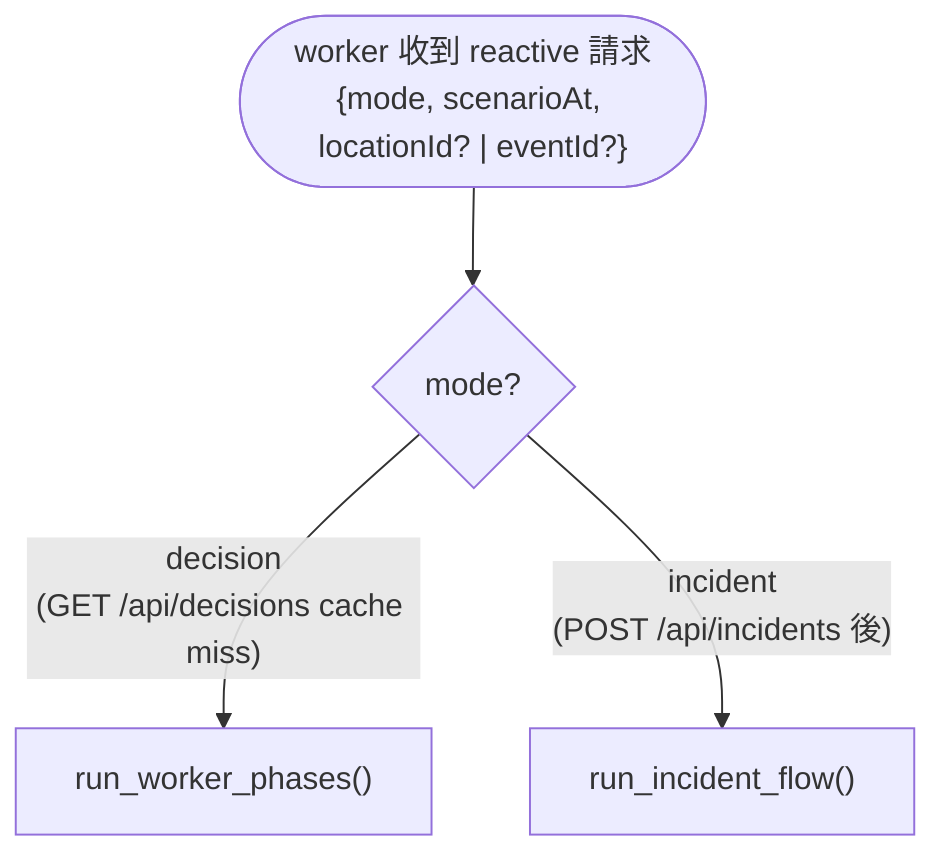
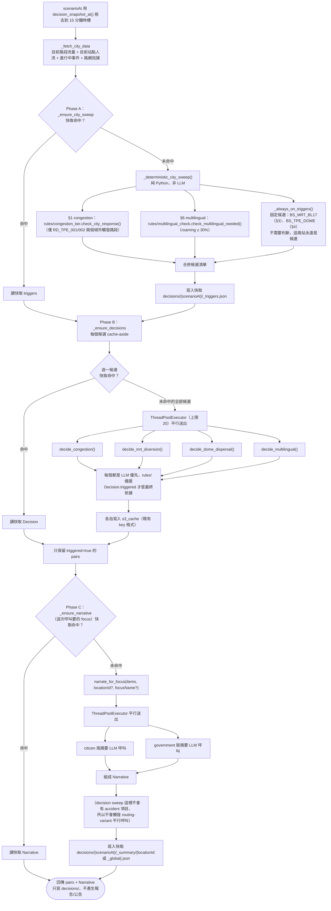
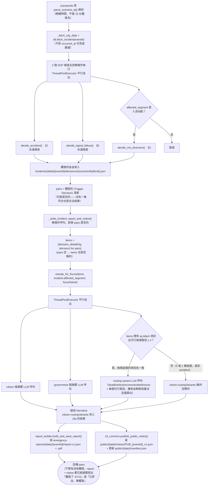

# decision-generator-worker 流程圖

搭配 [`WORKFLOW.md`](WORKFLOW.md) 文字說明看。這份只畫流程，欄位/格式細節在 WORKFLOW.md。

## 入口分流：`mode` 決定走哪條路

worker 收到 `{mode, scenarioAt, locationId? | eventId?}`，`mode` 完全決定接下來做什麼、寫到哪——不是看 SOP 種類、不是看有沒有 `eventId`。

## `mode: "decision"` —— 城市全域 sweep

只算「一般決策」（congestion/mrt_diversion/dome_dispersal/multilingual），**不含** accident/signal_failure（那是 incident 的工作），只寫 `decisions/`。

## `mode: "incident"` —— 單一事件判斷

只處理指定的 `eventId`，**不做城市 sweep**。up to 3 個 SOP 檢查全部無條件執行（沒有候選篩選這一步——每個送進來的事件都會被問，不像 decision sweep 需要先篩候選）。

## 兩條路徑的關鍵差異

| | `mode: "decision"` | `mode: "incident"` |
|---|---|---|
| 處理範圍 | 全市 sweep | 單一 `eventId` |
| Phase A（候選篩選） | 有（決定論：§1/§6 算出來、§3/§4 固定候選） | 沒有——3 個檢查全部無條件執行 |
| SOP 條文 | §1/§3/§4/§6 | §2/§5，條件符合再加 §3 |
| 寫入位置 | `decisions/` | `incidents/{date}/{eventId}/` + `emergency-reports/` + `public/` |
| 報告/公告 | 不產生 | 一律產生（含沒有觸發的情況） |
| `citizen.routingVariants` | 永遠空（不會有 accident 項目） | 有 accident 且候選 ≥ 2 條才會有內容 |
| scenarioAt 處理 | 捨去到 15 分鐘時槽 | 精確時間，不捨去 |
